# Market Pulse 📈

LIVE SITE: https://market-pulse-two.vercel.app/


---

> **Market Pulse** is a modern stock market analytics platform for traders, investors, and financial enthusiasts. It features real-time data, beautiful interactive charts, advanced technical analysis, portfolio management, and a world-class UI/UX.

---

## 🚀 Features

- 📊 Real-time Stock Charting & Analytics
- 🧑‍💼 **Portfolio Management** (track holdings, performance, sector allocation)
- 🧠 **Technical Indicators** (RSI, MACD, SMA, EMA, Bollinger Bands)
- 🛎️ **Advanced Price Alerts** (price, % change, volume, technical triggers)
- 📅 Customizable Timeframes (1D, 1W, 1M, 3M, 1Y, ALL)
- 🔄 Toggle Metrics: Open, Close, High, Low, Volume
- 🗂️ Watchlists & Quick Stock Search
- 🧩 Modular, Scalable Component Architecture
- 🧹 Optimized Data Fetching & Rate-Limiting
- 🎨 Responsive, Mobile-Friendly, Light/Dark Mode
- 🛡️ Delete Confirmation Modals & Error Handling
- 🌈 Modern, accessible, and branded UI/UX

---

## 🛠️ Tech Stack

| Category         | Technologies                                                 |
| ---------------- | ------------------------------------------------------------- |
| **Frontend**     | React.js, Vite, Tailwind CSS                                  |
| **State Mgmt**   | Zustand                                                      |
| **Charting**     | Chart.js                                                      |
| **APIs**         | Yahoo Finance, Twelve Data                                    |
| **Backend**      | Node.js, Express.js, JWT (Authentication)                     |
| **Deployment**   | Vercel (Frontend), Railway (Backend)                          |

---

## 🏁 Getting Started

### 1. **Clone the repo**
```bash
git clone https://github.com/your-username/market-pulse.git
cd market-pulse
```

### 2. **Install dependencies**
```bash
npm install
```

### 3. **Run locally**
```bash
npm run dev
```

### 4. **Build for production**
```bash
npm run build
```

---

## 🚦 Deployment Readiness
- ✅ No debug logs or test code in production
- ✅ All user flows (add/edit/delete holdings, charts, modals) work as expected
- ✅ No crashes or unhandled errors in the UI
- ✅ All state updates are correct and persistent
- ✅ UI is polished, modern, and consistent
- ✅ No sensitive data exposed in the client
- ✅ Dark mode and light mode both look great
- ✅ All charts and analytics are robust to empty/edge cases

---

## 🖼️ Screenshots

### **Light Mode**

<table>
  <tr>
    <td><b>Homepage</b></td>
    <td><b>Login Page</b></td>
    <td><b>Signup Page</b></td>
  </tr>
  <tr>
    <td>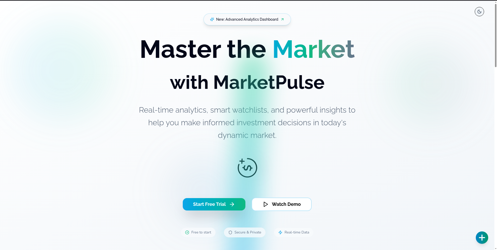</td>
    <td>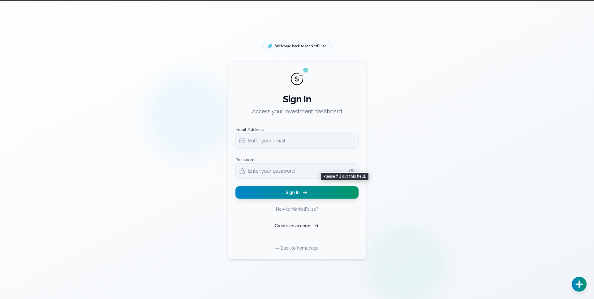</td>
    <td></td>
  </tr>
  <tr>
    <td><b>Dashboard</b></td>
    <td><b>Analytics Page 1</b></td>
    <td><b>Analytics Page 2</b></td>
  </tr>
  <tr>
    <td>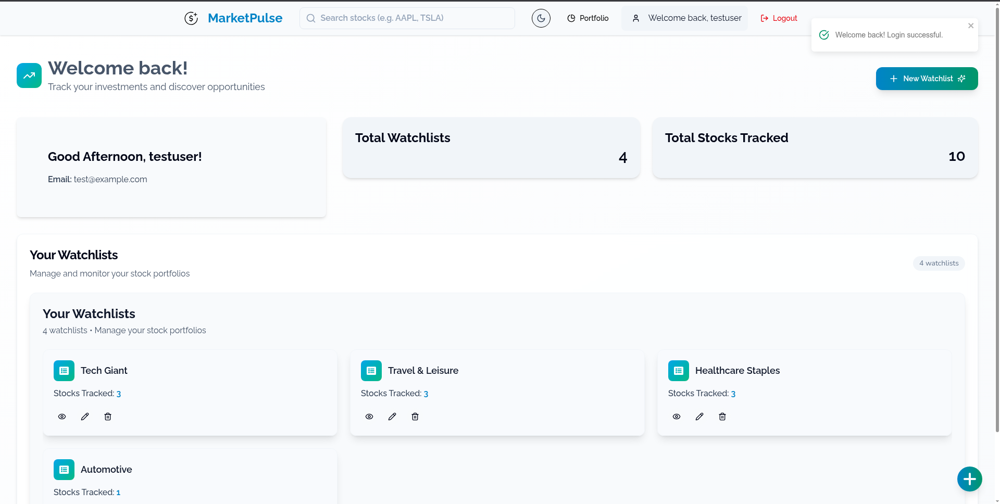</td>
    <td></td>
    <td></td>
  </tr>
  <tr>
    <td><b>Watchlist</b></td>
    <td><b>Portfolio Page 1</b></td>
    <td><b>Portfolio Page 2</b></td>
  </tr>
  <tr>
    <td>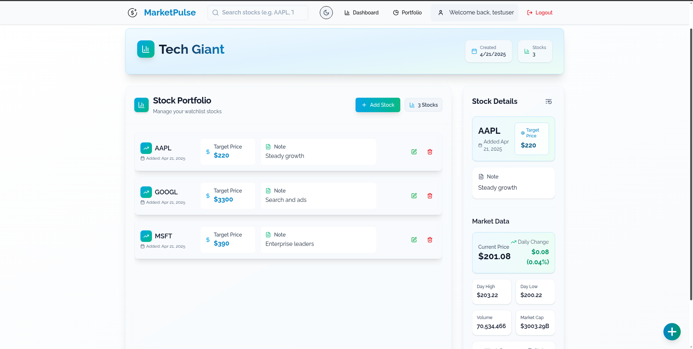</td>
    <td>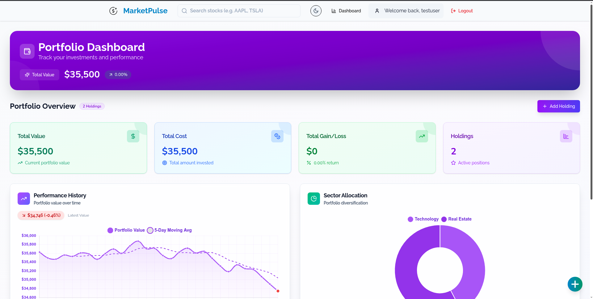</td>
    <td>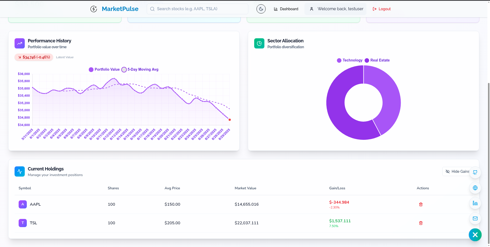</td>
  </tr>
</table>

### **Dark Mode**

<table>
  <tr>
    <td><b>Homepage</b></td>
    <td><b>Login Page</b></td>
    <td><b>Signup Page</b></td>
  </tr>
  <tr>
    <td>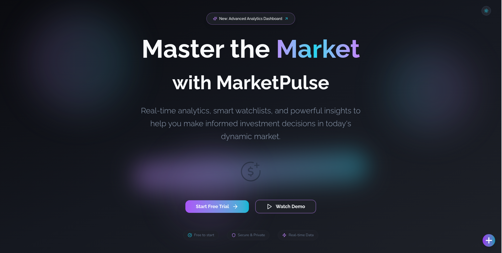</td>
    <td>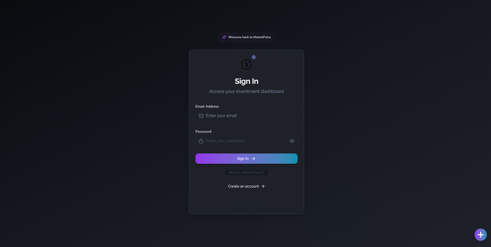</td>
    <td>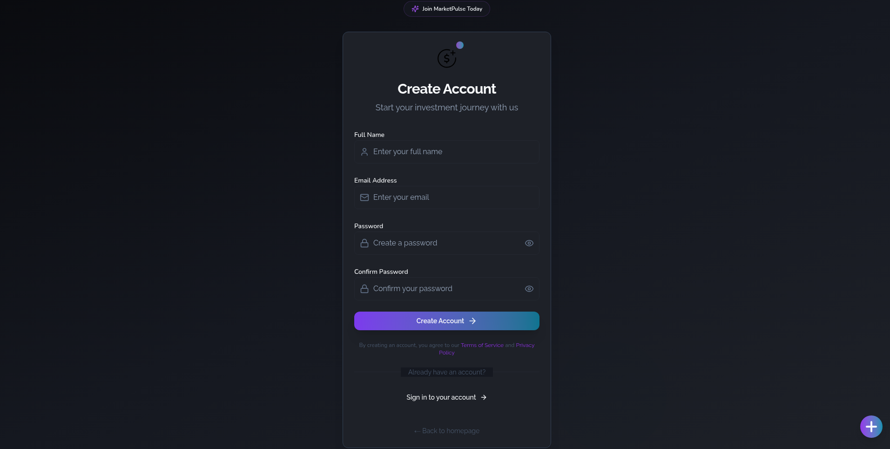</td>
  </tr>
  <tr>
    <td><b>Dashboard</b></td>
    <td><b>Analytics Page 1</b></td>
    <td><b>Analytics Page 2</b></td>
  </tr>
  <tr>
    <td>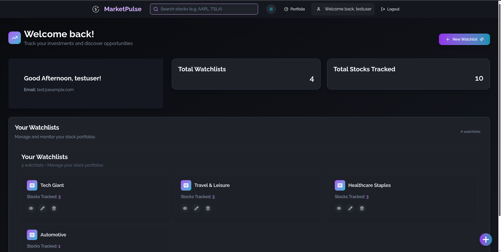</td>
    <td>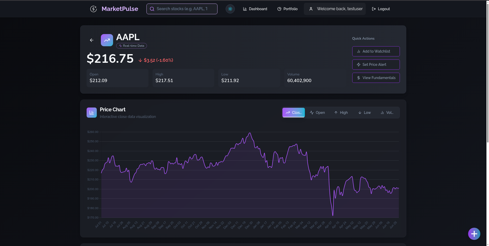</td>
    <td></td>
  </tr>
  <tr>
    <td><b>Watchlist</b></td>
    <td><b>Portfolio Page 1</b></td>
    <td><b>Portfolio Page 2</b></td>
  </tr>
  <tr>
    <td>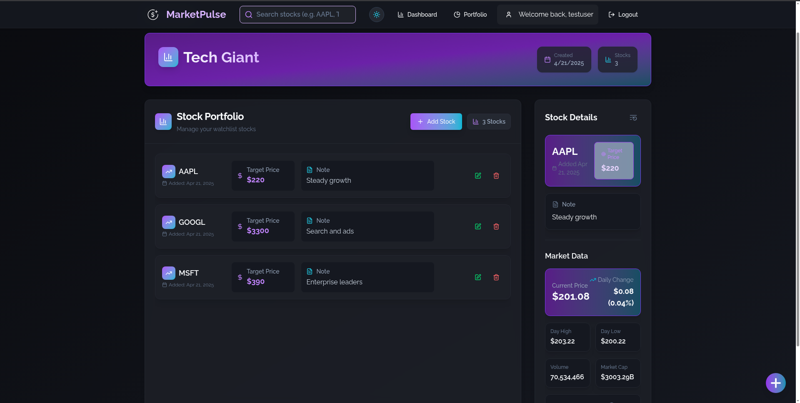</td>
    <td>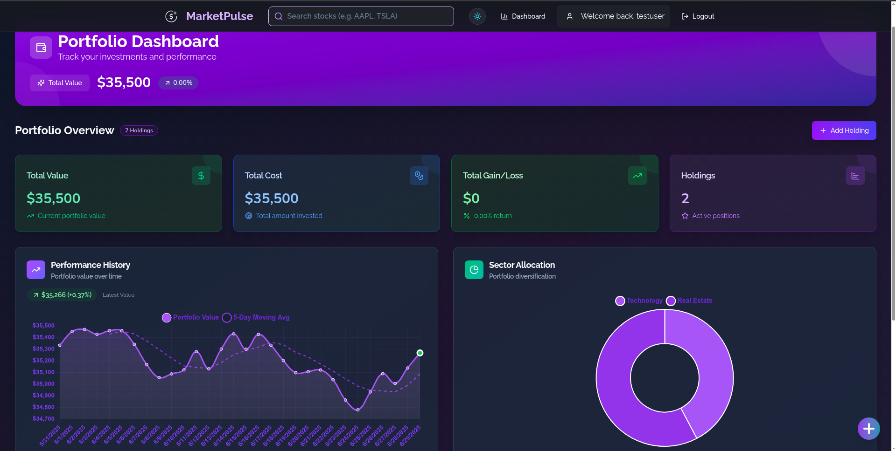</td>
    <td>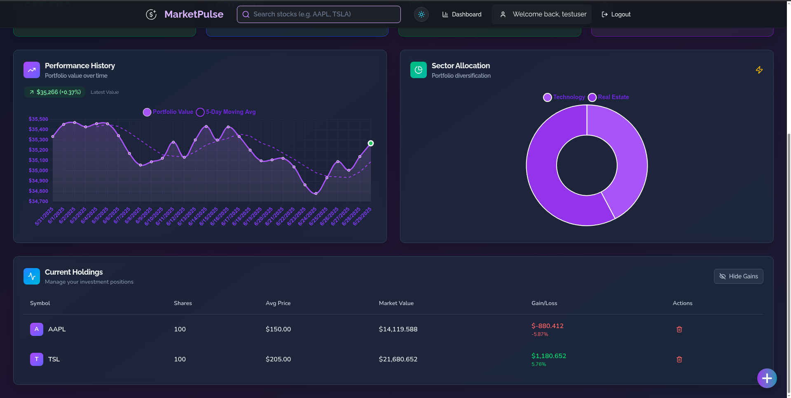</td>
  </tr>
</table>

---

## 📚 API Documentation

- **Provider 1:** [Yahoo Finance](https://www.yahoofinanceapi.com/)
- **Provider 2:** [Twelve Data](https://twelvedata.com/docs/)

---

## 📬 Contact

Let's connect!

- **LinkedIn:** [Abhishek Rajoria](https://linkedin.com/in/AbhishekRajoria)
- **Email:** AbhishekRajoria24@gmail.com

---

> *"In investing, what is comfortable is rarely profitable."* — **Market Pulse** 📈

---
