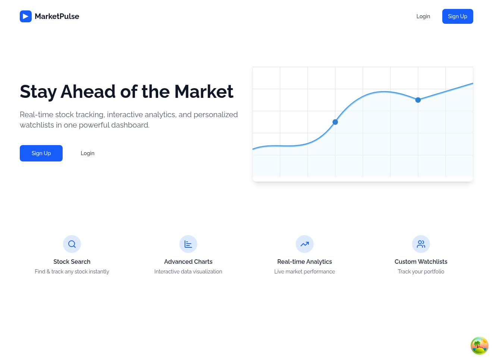
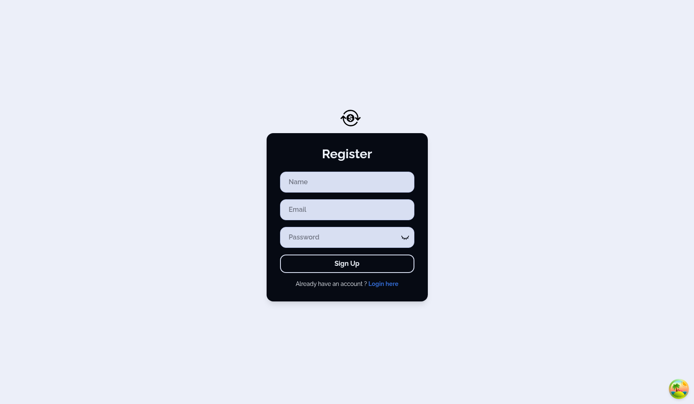
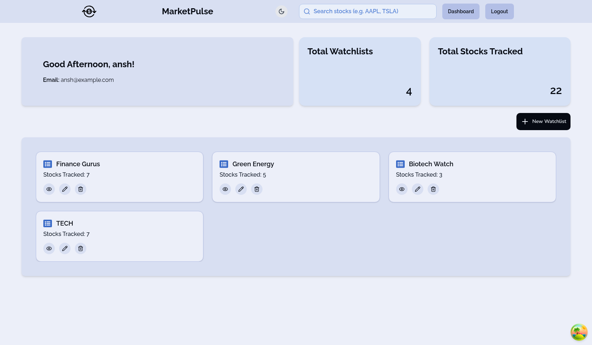
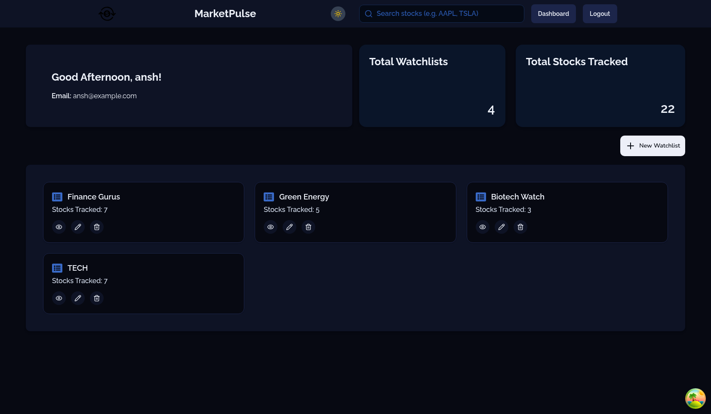
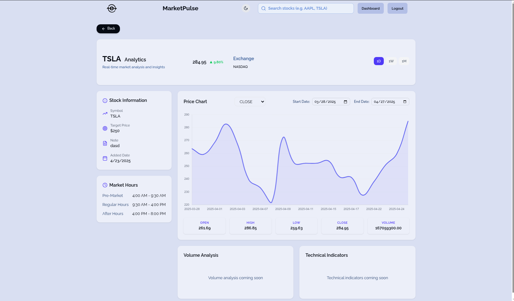
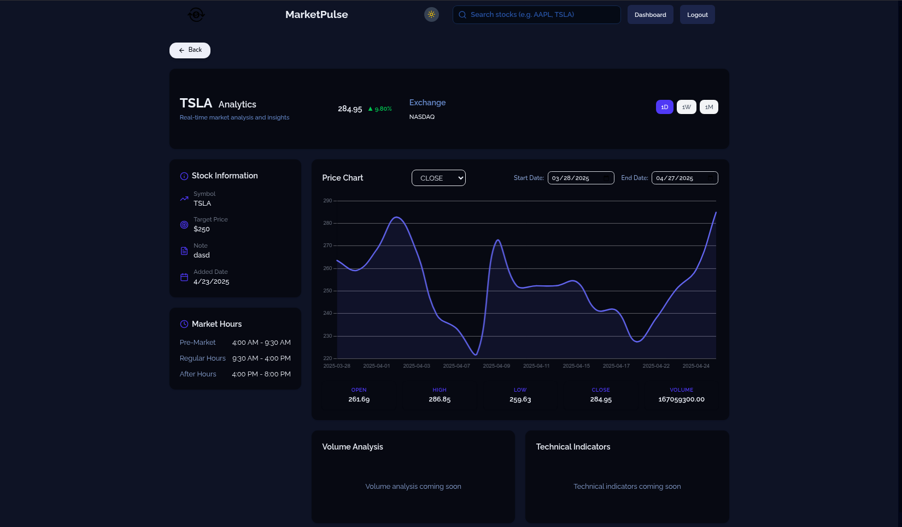
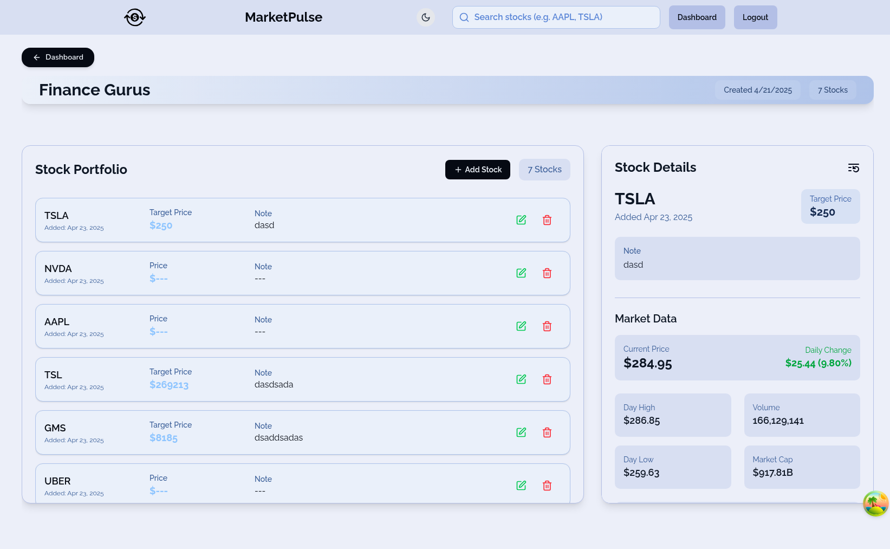
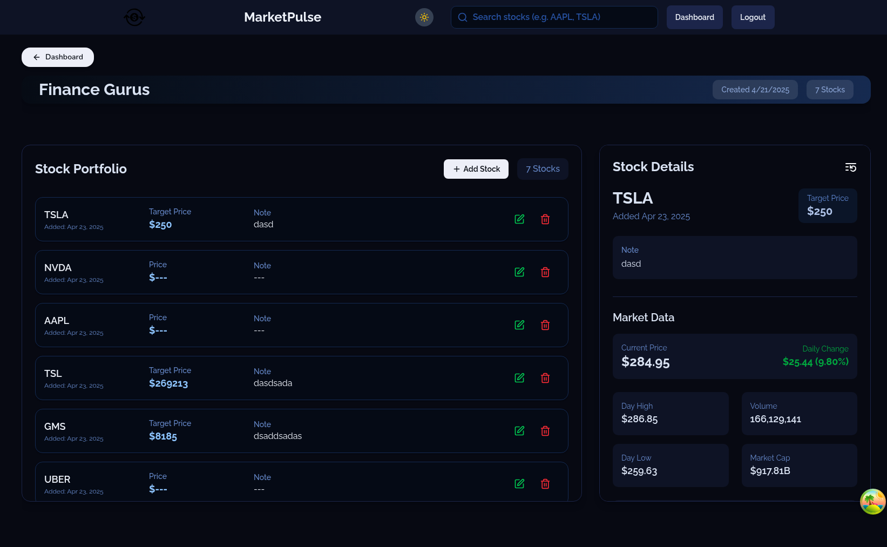

# Market Pulse 📈

---

> **Market Pulse** is a cutting-edge stock market analytics dashboard that empowers users with real-time market insights, beautiful data visualizations, and customizable analysis tools — all in a lightning-fast, responsive interface.

>Designed specifically for **traders, investors, and financial enthusiasts**, it provides dynamic, interactive charts with granular timeframe selections (1D, 1W, 1M, 3M, 1Y, ALL), allowing users to dive deep into stock performance over different periods.

>Users can effortlessly toggle between key metrics like **Open, Close, High, Low, Volume**, gaining full control over how they visualize and interpret stock movements. With a focus on speed, simplicity, and clarity, Market Pulse bridges the gap between raw financial data and actionable insights.

>Built with a modern, scalable tech stack **(React, Zustand, Chart.js, Tailwind CSS, Express, NodeJS)**, and powered by real-world stock APIs, it offers an experience that feels as sleek as it is powerful.

>Whether you're a day trader watching intraday trends, a long-term investor tracking performance, or a data nerd who loves beautiful charts — **Market Pulse** is built for you.

---

## 🚀 Features

- 📊 Real-time Stock Charting
- 📅 Customizable Timeframe Filters (1D, 1W, 1M, 3M, 1Y, ALL)
- 🔄 Toggle Metrics: Open, Close, High, Low, Volume
- 🧩 Modular & Scalable Component Architecture
- 🧠 Global State Management with Zustand
- 🧹 Optimized Data Fetching & Rate-Limiting
- 🗓️ Start/End Date Range Selector
- 🎨 Responsive, Mobile-Friendly Design
- 🌗 (Optional) Light/Dark Mode

---

## 🛠️ Tech Stack

| Category         | Technologies                                                 |
| ---------------- | ------------------------------------------------------------- |
| **Frontend**     | React.js, Vite, Tailwind CSS                                  |
| **State Mgmt**   | Zustand, React Query                                           |
| **Charting**     | Chart.js                                                       |
| **APIs**         | Yahoo Finance API, Twelve Data   |
| **Backend**      | Node.js, Express.js, JWT (Authentication)                     |
| **Deployment**   | Vercel (Frontend), Render (Backend)                   |

---

## 🚀 Deployment

The app is deployed on **Vercel** for seamless performance.

🔗 **Live Site:** [Market Pulse Live](https://your-live-link.com)

---

## 🖼️ Screenshots

<table>
  <tr>
    <td><b>Homepage</b></td>
    <td><b>Login Page</b></td>
    <td><b>Signup Page</b></td>
  </tr>
  <tr>
    <td></td>
    <td></td>
    <td></td>
  </tr>

  <tr>
    <td><b>Dashboard (Light Mode)</b></td>
    <td><b>Dashboard (Dark Mode)</b></td>
    <td><b>Analytics Page (Light Mode)</b></td>
  </tr>
  <tr>
    <td></td>
    <td></td>
    <td></td>
  </tr>

  <tr>
    <td><b>Analytics Page (Dark Mode)</b></td>
    <td><b>Watchlist Page (Light Mode)</b></td>
    <td><b>Watchlist Page (Dark Mode)</b></td>
  </tr>
  <tr>
    <td></td>
    <td></td>
    <td></td>
  </tr>
</table>

## 📚 API Documentation

- **Provider 1:** [Yahoo Finance](https://www.yahoofinanceapi.com/)
  - **Endpoints Used:**
    - `quote` — Get real-time stock data.
    - `historical` — Fetch historical stock data.
    - `search` — Search for stocks and related data.

- **Provider 2:** [Twelve Data](https://twelvedata.com/docs/)
  - **Endpoints Used:**
    - `quote` — Retrieve real-time stock data.
    - `historical` — Get historical stock data.
    - `time_series` — Fetch time series data (various timeframes).

## 📚 API Routes

### **Authentication Routes**
- **POST** `/api/auth/register` — Register a new user
- **POST** `/api/auth/login` — Login an existing user

### **External Stock Data Routes**
- **GET** `/api/getStock` — Fetch stock data for a single stock
- **GET** `/api/getStockforWatchlist` — Fetch stock data for multiple stocks in the user's watchlist
- **GET** `/api/chart` — Fetch stock chart data
- **GET** `/api/search` — Search for stocks

### **Watchlist Routes**
- **POST** `/api/watchlist` — Create a new watchlist
- **GET** `/api/watchlist` — Get all watchlists for the logged-in user
- **GET** `/api/watchlist/:watchlistId` — Get a specific watchlist by ID
- **DELETE** `/api/watchlist/:watchlistId` — Delete a watchlist by ID
- **PUT** `/api/watchlist/:watchlistId` — Update a watchlist by ID

#### **Stock Routes (Inside a Watchlist)**
- **GET** `/api/watchlist/:watchlistId/stocks` — Get all stocks in a specific watchlist
- **POST** `/api/watchlist/:watchlistId/stock` — Add a single stock to a specific watchlist
- **POST** `/api/watchlist/:watchlistId/stock` — Add multiple stocks to a specific watchlist
- **DELETE** `/api/watchlist/:watchlistId/stocks/:stockId` — Remove a stock from a specific watchlist
- **PUT** `/api/watchlist/:watchlistId/stocks/:stockId` — Update a stock inside a specific watchlist

---

## 🔮 Future Improvements

- 🧠 AI-based Stock Predictions
- 🛎️ Real-Time Push Notifications for Price Alerts
- 🗞️ Financial News Integration
- 🔄 WebSocket Live Price Streaming
- 🧹 Full Testing Suite (Jest + Cypress)
- 🌍 Multi-language (i18n) Support

---

## 🧡 About this Project

This project reflects:

- **Product Thinking:** Built like a real-world SaaS dashboard
- **Performance Engineering:** Rate-limited API fetching & caching
- **Scalable Code:** Component-based, easily extendable architecture
- **UI/UX First:** Clean, minimal, and highly responsive design

---

## 📬 Contact

Let's connect!

- **LinkedIn:** [Abhishek Rajoria](https://linkedin.com/in/AbhishekRajoria)
- **Email:** AbhishekRajoria24@gmail.com

---

> *“In investing, what is comfortable is rarely profitable.”* — **Market Pulse** 📈

---
