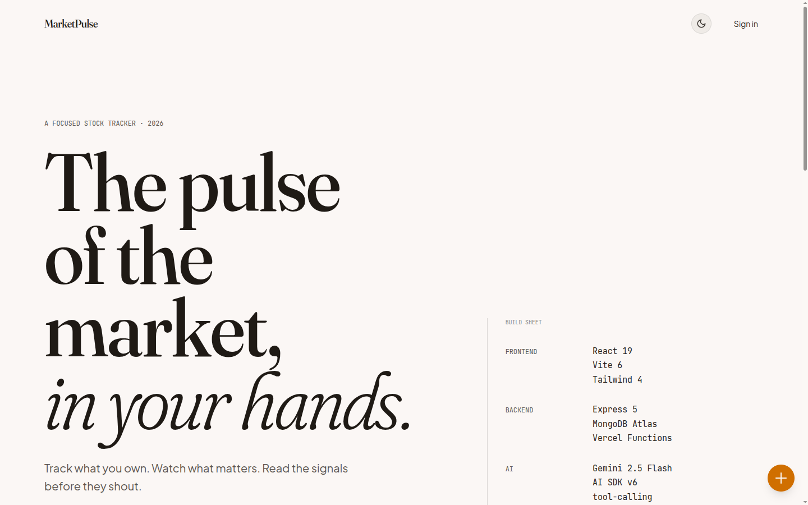
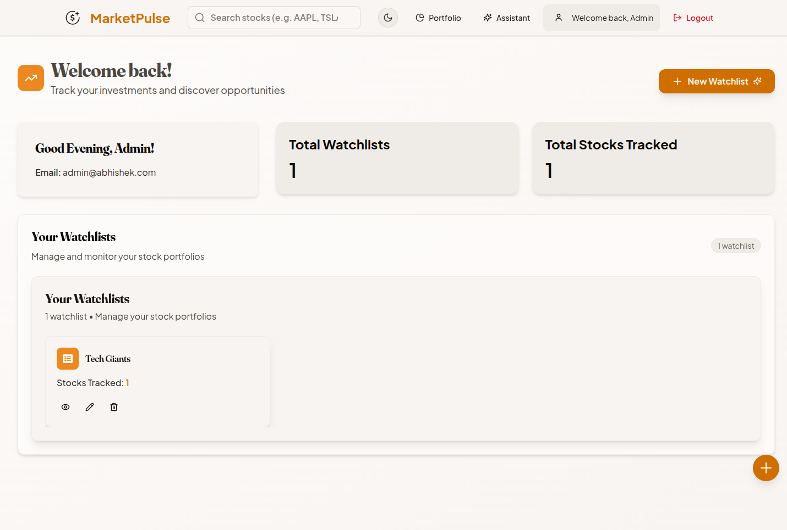
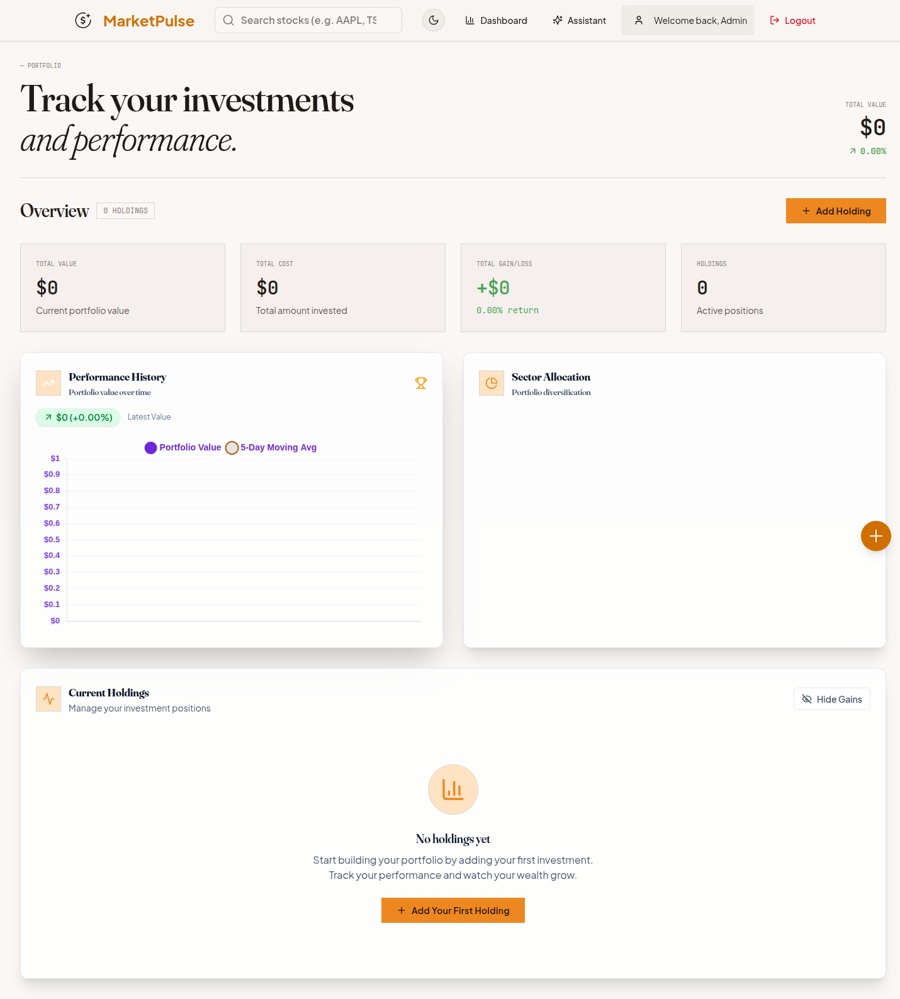
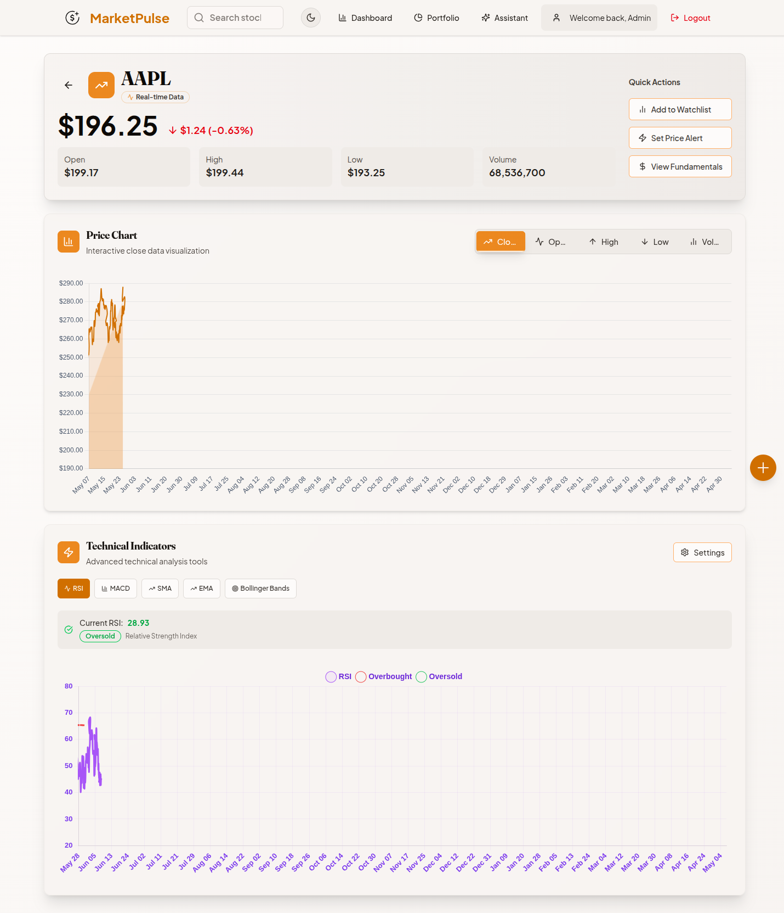
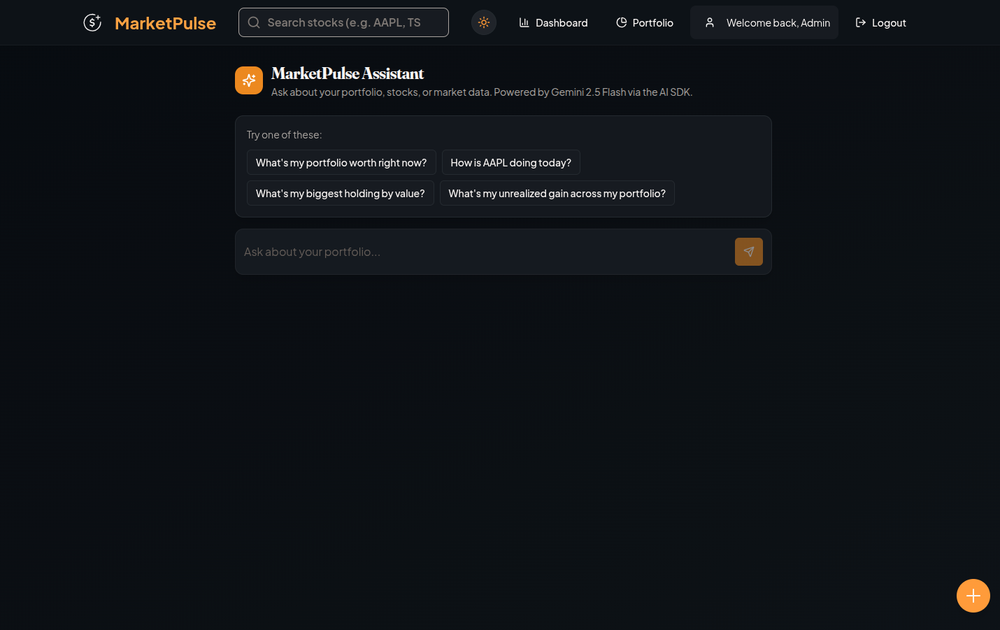
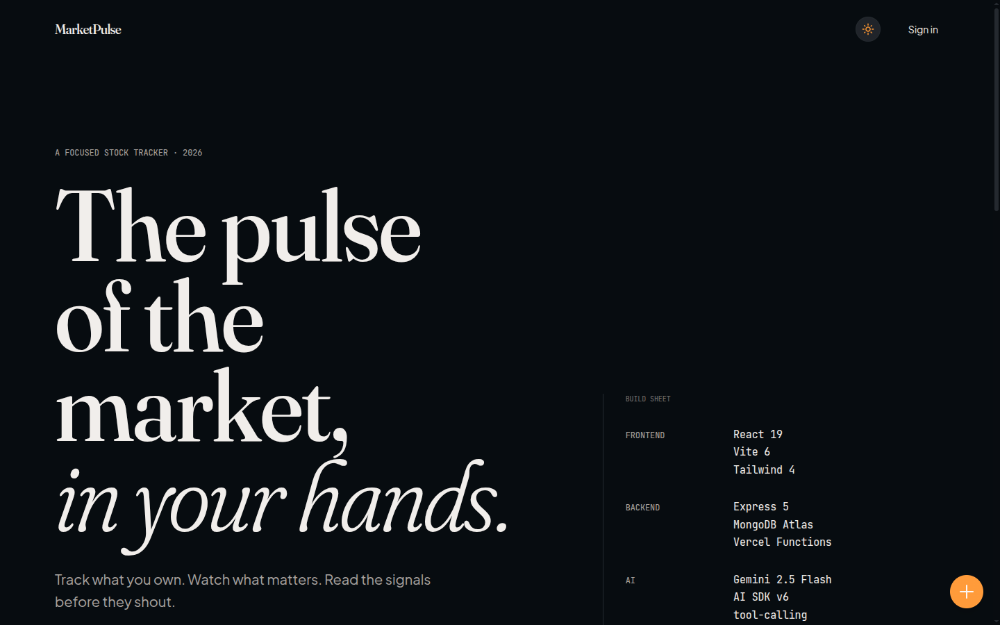
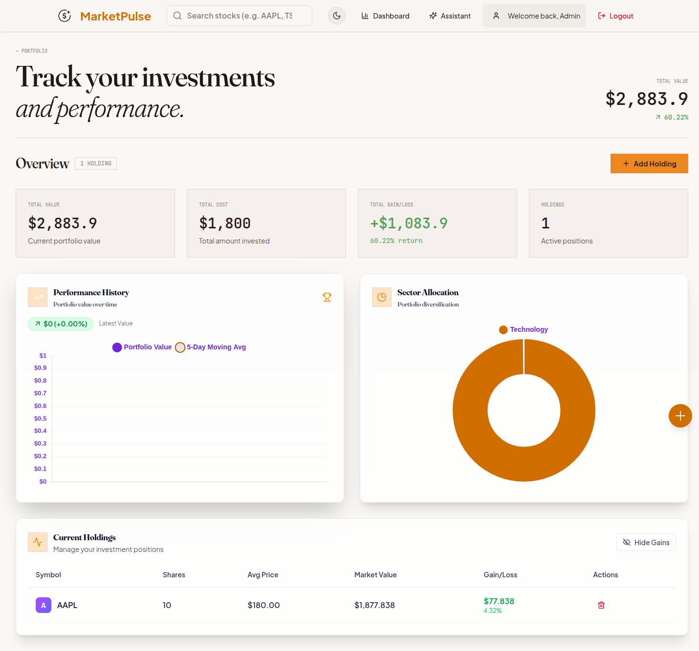
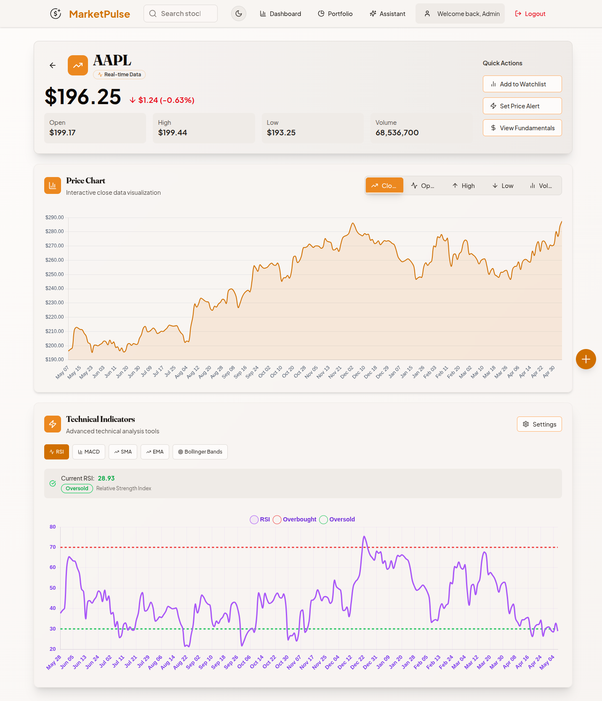
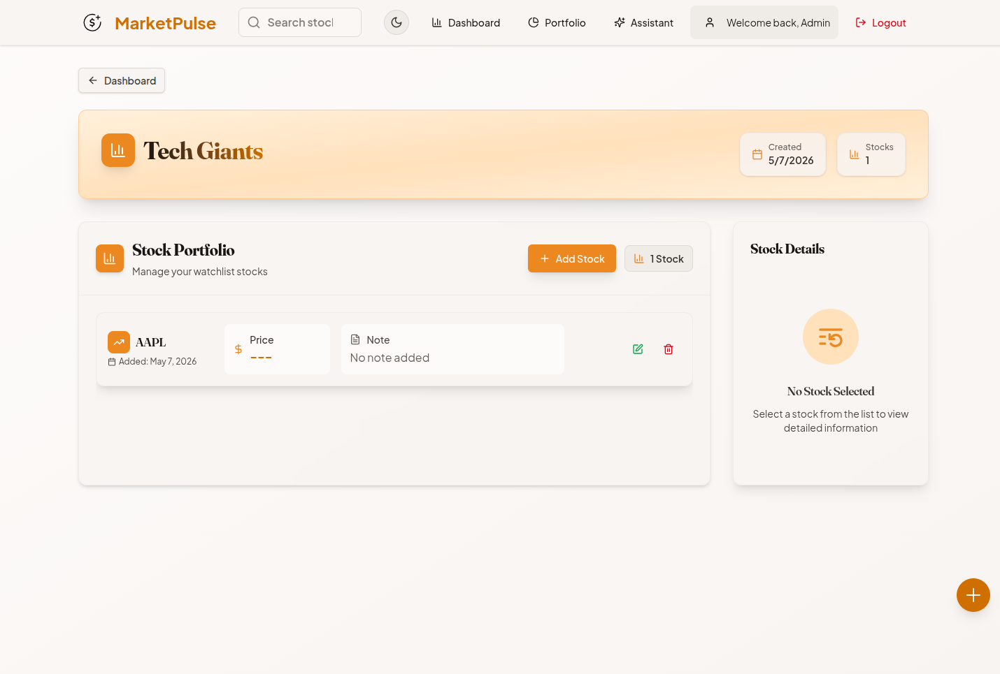
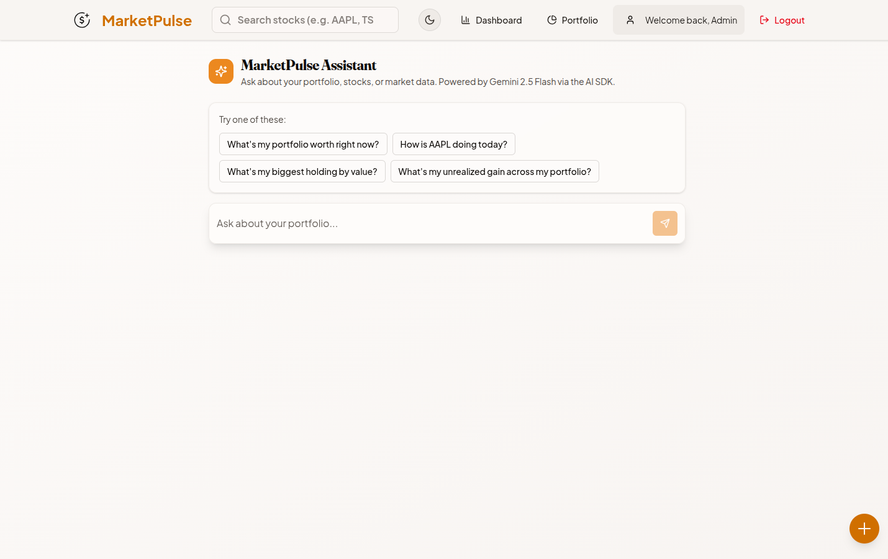

# MarketPulse

A focused stock-tracking SPA: watchlists, portfolio with real prices, interactive charts, and an AI assistant grounded in your actual data.

**Live:** https://market-pulse-two.vercel.app/
**Source:** https://github.com/Abhishek1334/MarketPulse

> Built as a portfolio piece. The goal was to ship a real fullstack app end-to-end — auth, third-party API integration, charting, state management, AI tool-calling, and single-platform deployment — and to keep every claim in this README honest.

---

## Stack

| Layer | Choice | Why |
| --- | --- | --- |
| Frontend | React 19, Vite 6, Tailwind v4 | Fast dev loop, modern build, utility-first styling |
| State | Zustand (auth, theme, portfolio cache) + TanStack Query (watchlists) | Clear split between client state and server cache |
| Charts | Chart.js + react-chartjs-2 | Light footprint vs. heavier alternatives |
| UI primitives | shadcn/ui (Radix + cva), lucide-react icons | Accessible, copy-paste, no runtime dep on a UI lib |
| Animation | GSAP for hero reveals, native CSS for everything else | One signature entrance, restrained micro-interactions |
| Typography | Fraunces (serif display), Plus Jakarta Sans (body), JetBrains Mono (numbers) | Editorial finance section feel; tabular numerals on prices |
| Backend | Express 5, Mongoose, MongoDB Atlas (cached connection) | Familiar Node stack, fast iteration |
| Auth | JWT (Bearer in `Authorization` header) | Simple, works without sessions |
| Market data | Twelve Data (search, quote, time-series) | Single provider after migrating off Yahoo Finance |
| AI | Vercel AI SDK v6 + Google Gemini 2.5 Flash (free tier) | Tool-call-driven assistant, streaming via `pipeUIMessageStreamToResponse` |
| Hosting | **Vercel** — single deploy, frontend + Express together as one Function | Sub-second cold start via Fluid Compute, free Hobby plan |

---

## Features

- **Watchlists** — multiple per user, add/remove stocks, server-cached quotes.
- **Portfolio** — holdings + transactions persisted to MongoDB. Real current prices fetched on every load and after every mutation.
- **Stock analytics** — interactive Chart.js price charts with technical indicators (RSI, MACD, SMA, EMA, Bollinger), timeframe + interval picker.
- **Symbol search** — Twelve Data search debounced through a server-cached endpoint.
- **AI assistant** (`/assistant`) — natural-language Q&A about your portfolio and any stock. Tool-calling agent with three tools: `getPortfolioSummary`, `getStockQuote`, `searchSymbol`. Streams responses via Server-Sent Events. Tool calls are visible in the UI ("🔧 Used: getStockQuote") so users can audit what the agent did.
- **Light + dark mode** — themed via OKLCH CSS variables. Brand accent unified across modes.
- **Server-side response cache** — namespace-scoped TTL cache (60s for quotes, 5min for charts, 1h for search/validate) extends the free-tier API quota during demos. Hit-rate exposed at `/api/stock/_cache-stats`.

---

## Architecture

```
┌──────────────────────────────────────────┐
│              Vercel deployment            │
│                                           │
│  ┌──────────────┐    ┌──────────────────┐ │
│  │ React SPA    │ /api/* │ Express app  │ │
│  │ (static dist)│ ─────► │ (Function)   │ │
│  └──────────────┘    └─────┬────────────┘ │
└─────────────────────────────┼─────────────┘
              │               │
   localStorage               │ Mongoose (cached connection)
   (auth + theme)             ▼
                       ┌─────────────┐
                       │  MongoDB    │
                       │  Atlas      │
                       └─────────────┘
                              ▲
                              │
              Twelve Data API ┘
              (proxied through Function,
              API key never reaches client)
```

**Data ownership:**
- **Server-of-record (Mongo):** users, watchlists, portfolio holdings, transactions, settings.
- **Client-only (Zustand persist → localStorage):** auth token, theme.

---

## Notable design decisions

**API proxy, not direct calls.** All Twelve Data requests go through Express. The API key stays server-side. Client never sees it. The downside: every quote lookup costs a server roundtrip, so we cache aggressively.

**Hybrid state model.** Zustand for things the client owns (auth, UI, portfolio cache). TanStack Query for things the server owns (watchlists). Portfolio actions are async API calls that re-trigger `loadPortfolio` afterward to keep the cache in sync with current quotes.

**Embedded subdocuments.** Holdings and transactions live as subdoc arrays inside one `Portfolio` doc per user, mirroring the watchlist+stocks shape. Trade-off: simpler reads, harder atomic updates at scale. Fine for the use case.

**Single-Function backend.** `api/index.js` exports the Express app and the `vercel.json` rewrite forwards every `/api/*` request through with the path preserved in a query parameter. The function reconstructs `req.url` before invoking the app, so Express routing works unchanged. This pattern works on any Vercel framework preset; the typical `[...slug]` catch-all convention is Next.js-only and silently drops requests on Vite projects.

**Mongoose connection caching.** `server/db.js` caches the connection on `globalThis._mongooseCache` so warm Function invocations reuse it instead of opening a new connection each request. Without this, Atlas blocks the deployment within minutes.

**Editorial design language.** Brand color is amber (`oklch(72% 0.16 60)`) shared across light and dark — the original code had it shifting from sky-blue to purple between modes, which read as two products. Display type is Fraunces (variable serif), body is Plus Jakarta Sans, numbers are JetBrains Mono with tabular numerals. The Homepage is laid out as a magazine spread (asymmetric 7/12 + 5/12 columns, oversized section numerals, marginalia labels) instead of the centered SaaS landing template that ships with most starter kits.

---

## Trade-offs and known limits

- **JWT in localStorage.** Simple, but XSS-readable. A production version would use httpOnly cookies.
- **No tests yet.** Build + lint + server syntax check run on every PR via GitHub Actions, but runtime behavior is verified manually with Playwright.
- **No real-time prices.** Quotes refresh on user action, not via WebSocket. The free Twelve Data tier doesn't include WS.
- **Free-tier rate limits.** Twelve Data is 8 req/min on the free plan. The server-side cache extends this significantly during demos, but a sustained burst will return errors.
- **Bundle size.** ~370 KB gzipped — Chart.js + GSAP + AI SDK are the bulk. Code-splitting `/assistant` and `/stocks/:symbol` would shave ~200 KB for cold first paint.

---

## Getting started

Requires Node 20+ and a MongoDB connection string.

```bash
git clone git@github.com:Abhishek1334/MarketPulse.git
cd MarketPulse
npm install
cd server && npm install && cd ..
```

Create a `.env` in `server/`:

```env
MONGO_URI=mongodb+srv://...
JWT_SECRET=<a long random string>
TWELVE_DATA_API_KEY=<from twelvedata.com — free>
GOOGLE_GENERATIVE_AI_API_KEY=<from aistudio.google.com/app/apikey — free, optional, enables /assistant>
PORT=5000
```

> The AI assistant uses Gemini 2.5 Flash, which has a permanent free tier on Google AI Studio (no card required). If `GOOGLE_GENERATIVE_AI_API_KEY` is missing, `/assistant` returns a graceful "not configured" message instead of crashing.

Run dev (two terminals):

```bash
# terminal 1 — backend
npm run dev:server

# terminal 2 — frontend
npm run dev
```

Build for production:

```bash
npm run build
```

---

## Deploy to Vercel (5 minutes, free)

The repo is set up so the Express backend runs as a single Vercel Function alongside the static frontend.

1. **Push the repo to GitHub** (if not already).
2. **Create a Vercel project**: vercel.com → Add New → Project → import the repo.
   - Framework preset: **Vite** (auto-detected).
   - Root directory: leave as repo root.
   - Build command, output directory: leave defaults.
3. **Set environment variables** in Project Settings → Environment Variables for *Production + Preview + Development*:
   ```
   MONGO_URI                       (your MongoDB Atlas connection string)
   JWT_SECRET                      (any long random string)
   TWELVE_DATA_API_KEY             (free key from twelvedata.com)
   GOOGLE_GENERATIVE_AI_API_KEY    (free key from aistudio.google.com/app/apikey)
   ```
4. **MongoDB Atlas → Network Access → add `0.0.0.0/0`** so Vercel's dynamic IPs can connect.
5. **Click Deploy.** First build takes ~2 minutes.

Frontend and backend live on the same domain. No CORS config, no two-host coordination, no sleep.

### How it's wired
- `api/index.js` exports the Express app from `server/app.js` as a Vercel Function.
- `vercel.json` rewrites every `/api/:path*` request to `/api?__path=:path*`. The handler reconstructs `req.url = "/api/" + __path` before invoking Express, so app routing works unchanged.
- `vercel.json` rewrites every non-`/api` path to `/index.html` for SPA routing, with a path-to-regexp negative lookahead `((?!api).*)` to avoid eating API requests.
- `server/db.js` caches the Mongoose connection on `globalThis._mongooseCache` so warm Function invocations reuse it.
- `server/app.js` runs an Express middleware that awaits `connectDB()` before any handler — instant on warm starts, transparent on cold.
- Function `maxDuration` is set to 60s in `vercel.json` to cover AI streaming responses.

---

## Screenshots

### Light mode

| Homepage | Dashboard | Portfolio |
| --- | --- | --- |
|  |  |  |

| Analytics | Watchlist | Assistant |
| --- | --- | --- |
|  |  |  |

### Dark mode

| Homepage | Dashboard | Portfolio |
| --- | --- | --- |
|  |  |  |

| Analytics | Watchlist | Assistant |
| --- | --- | --- |
|  |  |  |

Full set in [`/screenshots`](./screenshots).

---

## What I'd do differently next time

- **TypeScript from day one.** Most defects in this repo were prop-shape or response-shape mismatches that TS would have caught.
- **Tests as a first-class citizen.** Even a small Vitest + Playwright harness would have caught several API-argument-order and stale-state bugs that surfaced in late-stage testing.
- **Code-split per route.** A 1.2 MB unsplit bundle is fine for an in-house tool, dragging on a public landing page.
- **Real-time prices via WebSocket.** Polling for quotes reads as a 2018 product when the upstream supports streams.

---

## Contact

- GitHub: [@Abhishek1334](https://github.com/Abhishek1334)
- LinkedIn: [Abhishek Rajoria](https://linkedin.com/in/AbhishekRajoria)
- Email: AbhishekRajoria24@gmail.com
